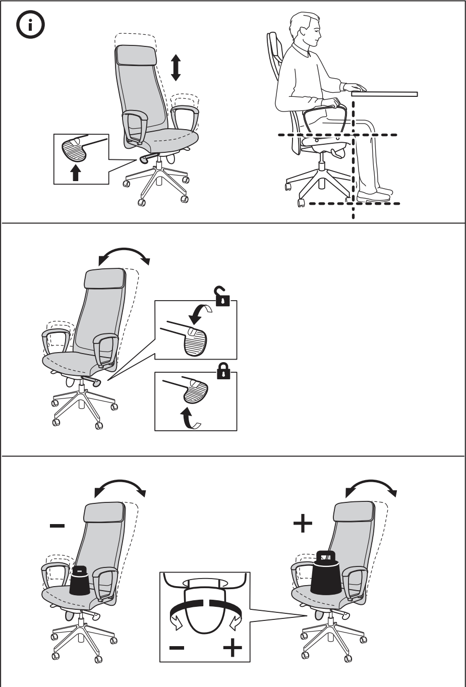

# MarkusChair
Hey there! 👋
I see you found my chair. Great! Feel free to try it, use it for a day if I'm not in the office. Here's an introduction of it:

The IKEA Markus is an ideal blend of comfort, support, and affordability. Designed with long working hours in mind, it offers excellent lumbar support and an adjustable headrest, ensuring your back stays protected and comfortable throughout the day. Its sleek design fits any office aesthetic, and its durability means you get great value for your money.

Make sure to tinker with it, here are all the possible adjustments you can make (don't worry I can quickly reset it to the way I like it)

## If you like it I have great news for you!
**You too** can this wonderful chair, the only thing you need to do is make an ops request for it!
On slack write `/ops_request` and fill out the info. If you're feeling particularly lazy today you can use these info:

>Link to chair: https://www.ikea.com.tw/en/products/office-workspace/office-chairs/markus-art-50261151
>
>Link to articles enforcing it's CP value and budget nature:
>
>https://www.creativebloq.com/buying-guides/best-budget-office-chair
>
>https://www.reddit.com/r/Frugal/comments/tft7sw/has_anybody_found_a_good_comfortable_budget/
>
>In your ops request you can attach the links. Your request text can include:
>
>This chair offers essential lumbar support and adjustability, which are crucial for maintaining good posture and preventing back issues during extended working hours. It is one of the most cost-effective options available that meets these ergonomic needs, ensuring both health benefits and financial prudence. Your approval for this purchase would greatly enhance my daily comfort and productivity.

### Let's make our office more comfortable for everyone!
